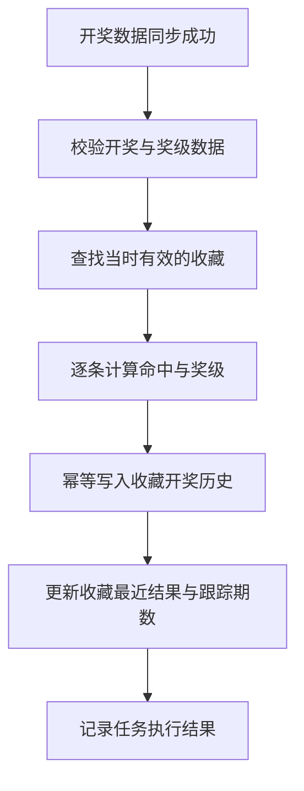
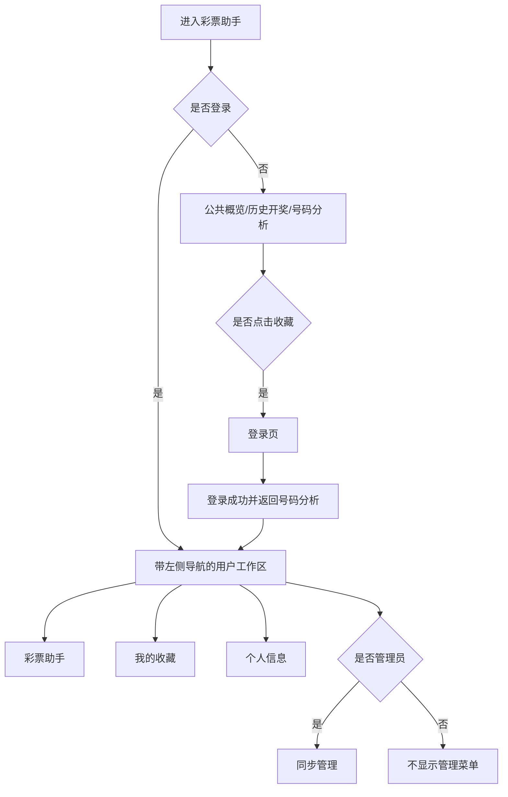

# lottery-assistant 产品需求文档（V1）

## 1. 文档信息

| 项目 | 内容 |
|---|---|
| 项目名称 | lottery-assistant |
| 模块名称 | 彩票助手 |
| 文档类型 | 产品需求文档（PRD） |
| 文档版本 | V1 |
| 文档状态 | 开发基线 |
| 更新日期 | 2026-07-09 |
| 首版票种 | 中国体彩大乐透（DLT） |
| 目标读者 | 产品、UI/UX、前端、后端、Python 数据服务、测试及开发 Agent |

### 1.1 文档用途

本文档用于指导 `lottery-assistant` 的首次产品设计、UI/UX 设计、技术设计、前后端开发、Python 数据采集、联调和测试验收。文档中的产品范围、角色权限、业务规则、页面流转、接口建议和验收标准共同构成 V1 的开发基线。

---

## 2. 产品概述

### 2.1 产品定位

`lottery-assistant` 是面向彩票开奖数据查询、号码历史回测和个人号码持续跟踪的工具。

首版聚焦中国体彩大乐透，帮助用户完成以下任务：

- 查看最新开奖、近期开奖和开奖详情。
- 按期号或开奖日期查询历史开奖。
- 输入一注或多注号码，分析其历史中奖情况。
- 登录后收藏关注的号码。
- 在后续每期开奖入库后，自动形成收藏号码的开奖结果历史。
- 由管理员维护开奖数据同步任务和同步日志。

### 2.2 产品原则

1. **公共查询无需登录**：游客可以直接使用概览、历史开奖、开奖详情和号码分析功能。
2. **个人数据必须登录**：个人资料、收藏号码和收藏开奖历史与用户账号绑定。
3. **管理能力严格隔离**：只有管理员可以访问同步管理页面和调用管理端接口。
4. **结果可追溯**：收藏开奖历史保存当期号码、命中情况、奖级和计算时间快照。
5. **数据处理幂等**：同一收藏号码与同一期开奖只能生成一条有效历史记录。
6. **文案保持中立**：不得使用“预测”“推荐”“稳赚”“提高中奖率”等引导性表达。

### 2.3 固定声明

号码分析和收藏开奖历史页面必须展示：

> 分析结果仅基于历史开奖数据，不代表未来开奖结果或中奖概率。

所有开奖数据展示区域必须提供数据说明：

> 开奖数据仅供参考，最终结果以中国体彩网官方公布为准。

---

## 3. 产品目标与范围

### 3.1 版本目标

V1 需要实现：

1. 游客可以无障碍使用概览、历史开奖、开奖详情和号码分析。
2. 用户可以登录、退出登录，并在刷新页面后恢复登录状态。
3. 登录用户可以查看和修改个人资料。
4. 登录用户可以从号码分析结果中收藏单注号码。
5. 登录用户可以查看、命名、备注和取消收藏号码。
6. 新期开奖成功入库后，系统可以自动生成收藏号码的当期开奖结果。
7. 登录用户可以按收藏号码、期号、日期和结果筛选收藏开奖历史。
8. 管理员可以执行最新开奖、期号范围和日期范围同步，并查看同步日志。
9. 前端菜单、路由和后端接口均按角色实施权限控制。
10. 页面流转、返回位置和未授权处理保持一致。

### 3.2 本期不做

1. 彩票预测、号码推荐、智能选号或概率承诺。
2. 购买、支付、下单、投注、自动投注或代购彩票。
3. 收藏号码的开奖通知、短信、邮件或站内推送。
4. 收藏前历史开奖记录的自动回填；用户仍可使用号码分析查看历史回测。
5. 面向管理员的用户、角色和权限配置后台。
6. 自助注册、找回密码和修改密码；由项目统一账号体系另行提供。
7. 收藏号码分享、公开榜单或社交互动。
8. 多票种正式开放；本期仅保留扩展能力。
9. 复杂走势图、冷热号、遗漏统计等分析工具。
10. 同步异常的外部告警推送。

---

## 4. 用户身份与角色权限

### 4.1 身份定义

| 身份 | 角色编码 | 说明 |
|---|---|---|
| 游客 | ANONYMOUS | 未登录访问者，不对应系统账号 |
| 登录用户 | USER | 已登录普通账号，拥有个人资料、收藏和收藏历史能力 |
| 管理员 | ADMIN | 已登录管理员账号，继承登录用户能力并拥有同步管理权限 |

### 4.2 权限矩阵

| 功能 | 游客 | 登录用户 | 管理员 |
|---|:---:|:---:|:---:|
| 查看概览 | ✓ | ✓ | ✓ |
| 查询历史开奖 | ✓ | ✓ | ✓ |
| 查看开奖详情 | ✓ | ✓ | ✓ |
| 单注/批量号码分析 | ✓ | ✓ | ✓ |
| 登录 | ✓ | - | - |
| 退出登录 | - | ✓ | ✓ |
| 查看/修改个人资料 | - | ✓ | ✓ |
| 收藏号码 | - | ✓ | ✓ |
| 查看/管理我的收藏 | - | ✓ | ✓ |
| 查看收藏开奖历史 | - | ✓ | ✓ |
| 访问同步管理页面 | - | - | ✓ |
| 触发开奖同步 | - | - | ✓ |
| 查看同步日志 | - | - | ✓ |

### 4.3 权限控制规则

1. 前端菜单隐藏不是权限控制的唯一手段，后端必须独立校验身份和角色。
2. 游客访问个人或管理员页面时，跳转登录页并携带原目标地址。
3. USER 访问管理员路由时进入 403 无权限页面，不自动跳回登录页。
4. 未认证请求调用个人接口时返回 401；角色不足调用管理接口时返回 403。
5. ADMIN 继承 USER 的全部个人功能。
6. 用户只能访问和操作属于自己的个人资料、收藏号码和收藏开奖历史。
7. 所有管理端写操作记录操作人、时间、参数和结果。

---

## 5. 信息架构与导航

### 5.1 游客页面框架

游客使用公共页面框架，不展示个人中心和管理菜单。

```text
顶部区域
├── 产品标识
├── 彩票助手入口
└── 登录入口

主内容区
└── 彩票助手
    ├── 概览
    ├── 历史开奖
    └── 号码分析
```

### 5.2 登录后页面框架

登录用户进入统一工作区布局，左侧导航栏固定展示：

```text
左侧导航
├── 彩票助手
├── 我的收藏
└── 个人信息
```

管理员左侧导航在上述基础上增加：

```text
管理
└── 同步管理
```

### 5.3 推荐路由

| 页面 | 路由 | 访问要求 |
|---|---|---|
| 登录 | `/login` | 游客 |
| 彩票助手 | `/lottery-assistant` | 公开 |
| 彩票助手指定标签 | `/lottery-assistant?tab=overview|history|analyze` | 公开 |
| 我的收藏 | `/favorites` | USER / ADMIN |
| 收藏详情与历史 | `/favorites/:favoriteId` | 所有者本人 |
| 个人信息 | `/profile` | USER / ADMIN |
| 同步管理 | `/admin/lottery-sync` | ADMIN |
| 无权限 | `/403` | 公开 |
| 页面不存在 | `/404` | 公开 |

### 5.4 导航状态规则

1. 彩票助手仍采用一个模块页面和三个内部标签，不拆成三个独立页面。
2. 当前标签通过 `tab` 查询参数表达，支持刷新、复制链接和浏览器前进/后退。
3. 从概览“查看全部历史开奖”进入 `tab=history`。
4. 从收藏历史打开开奖详情时使用弹窗或抽屉，关闭后保留原筛选、分页和滚动位置。
5. 登录成功后优先返回登录前目标地址；无目标地址时返回彩票助手。
6. 退出登录后返回彩票助手公共概览，并清理仅属于用户的前端状态。
7. 页面刷新后先恢复会话，再决定菜单和路由权限，避免管理员菜单闪现给普通用户。

---

## 6. 核心页面清单

| 编号 | 页面 | 核心职责 | 角色 |
|---|---|---|---|
| P01 | 登录 | 完成身份认证并返回原目标页面 | 游客 |
| P02 | 彩票助手—概览 | 最新开奖、下次开奖、最近 5 期 | 全部 |
| P03 | 彩票助手—历史开奖 | 按期号/日期查询和分页 | 全部 |
| P04 | 彩票助手—号码分析 | 单注/批量输入、历史回测、收藏入口 | 全部 |
| P05 | 开奖详情弹窗 | 开奖号码、金额和奖级明细 | 全部 |
| P06 | 我的收藏 | 收藏列表、编辑、取消收藏和快速查看历史 | USER / ADMIN |
| P07 | 收藏详情 | 单个收藏的基本信息和开奖历史 | 所有者本人 |
| P08 | 个人信息 | 查看账号信息并修改允许编辑的资料 | USER / ADMIN |
| P09 | 同步管理 | 手动同步、自动任务状态和同步日志 | ADMIN |
| P10 | 403/404 | 无权限和无效路由反馈 | 全部 |

---

## 7. 登录与会话需求

### 7.1 登录页面

登录表单包含：

- 用户名。
- 密码。
- 登录按钮。

交互规则：

1. 用户名和密码必填。
2. 提交期间按钮进入加载状态，禁止重复提交。
3. 登录成功后获取当前用户资料和角色权限。
4. 登录失败时展示统一错误文案，不暴露账号是否存在。
5. 已登录用户访问 `/login` 时自动跳转彩票助手。
6. 登录页不提供本期范围之外的注册和找回密码入口。

建议错误文案：

```text
用户名或密码错误，请重新输入。
```

### 7.2 会话恢复

1. 应用初始化时请求当前用户信息以恢复登录状态。
2. 会话有效时恢复用户资料、角色和菜单。
3. 会话失效时清理本地用户状态；公共页面继续可用。
4. 用户正在个人页面时会话失效，跳转登录页并保留返回地址。
5. 用户正在公共页面时会话失效，不强制离开当前页面，只切换为游客状态。

### 7.3 退出登录

1. 用户通过头像菜单或个人信息页执行退出登录。
2. 退出后服务端会话失效，前端清除用户、角色和个人数据缓存。
3. 退出后跳转 `/lottery-assistant?tab=overview`。

---

## 8. 个人信息需求

### 8.1 页面内容

个人信息页展示：

| 字段 | 是否可编辑 | 说明 |
|---|:---:|---|
| 用户名 | 否 | 账号唯一标识 |
| 角色 | 否 | 普通用户或管理员 |
| 昵称 | 是 | 页面展示名称，1–30 个字符 |
| 头像 | 是 | 可选；V1 支持默认头像和头像 URL |
| 创建时间 | 否 | 账号创建时间 |
| 最后登录时间 | 否 | 最近成功登录时间 |

### 8.2 编辑规则

1. 页面默认展示只读信息和可编辑表单。
2. 昵称去除首尾空格后不能为空。
3. 保存成功后同步更新全局用户状态和导航栏展示。
4. 保存失败时保留用户已输入内容并提示重试。
5. 用户只能修改自己的个人资料。
6. 密码修改和账号安全设置不在本期范围内。

---

## 9. 彩票助手公共功能

### 9.1 公共区域

彩票助手页面展示：

```text
彩票助手
查看开奖数据，分析号码历史命中情况
票种：[大乐透 ▼]

[概览] [历史开奖] [号码分析]
```

规则：

1. 默认进入概览标签。
2. 首版票种选择器仅开放大乐透，但保留多票种形态。
3. 切换标签时当前票种不变。
4. 标签切换期间保留历史开奖查询条件和号码输入草稿。
5. 登录状态变化不影响公共查询页面的继续使用。

### 9.2 概览

概览包含：

- 最新开奖：票种、期号、开奖日期、号码、奖池、销售额、更新时间。
- 下次开奖：下次开奖时间、动态倒计时或“等待开奖/数据同步中”状态。
- 最近 5 期开奖：期号、日期、开奖号码和详情入口。

交互规则：

1. 点击最近开奖或最近 5 期中的“详情”打开开奖详情弹窗。
2. 点击“查看全部历史开奖”切换到历史开奖标签。
3. 倒计时由后端返回的下一期开奖时间驱动，前端进行本地计算。

### 9.3 历史开奖

查询条件：

| 条件 | 规则 |
|---|---|
| 期号 | 精确匹配，按字符串处理 |
| 开始日期 | 不得晚于结束日期 |
| 结束日期 | 不得早于开始日期 |
| 页码 | 默认 1 |
| 每页条数 | 默认 10，可选 10/20/50 |

列表字段：期号、开奖日期、开奖号码、奖池金额、销售金额、详情。

需要支持加载中、无数据、加载失败、重试和分页状态。

### 9.4 开奖详情

开奖详情包含：

- 彩票类型、期号和开奖日期。
- 按号码分组展示的开奖号码。
- 奖池金额和销售金额。
- 奖级、中奖规则、中奖注数和单注奖金。
- 数据来源和最后更新时间。

关闭详情后仍停留在打开详情前的页面状态。

### 9.5 号码分析

号码分析支持单注输入和批量输入。

大乐透单注规则：

| 分组 | 数量 | 范围 | 是否可重复 | 展示颜色 |
|---|---:|---|:---:|---|
| 前区 | 5 | 01–35 | 否 | 红色 |
| 后区 | 2 | 01–12 | 否 | 蓝色 |

批量输入格式：

```text
01 05 12 23 35 + 03 11
02 09 16 22 33 + 04 09
```

批量规则：

1. 每行一注，使用 `+` 分隔前区和后区。
2. 校验错误必须指出行号和具体原因。
3. 单次最多分析 50 注，限制值由后端配置。
4. 分析结果展示总注数、中奖注数/次数、最高奖级和命中明细。
5. 无中奖记录时明确展示空状态。
6. 号码分析接口为公共接口，不要求登录。

### 9.6 分析结果中的收藏入口

1. 每一注规范化后的号码旁展示收藏状态或收藏按钮。
2. 单注分析结果可以直接收藏该注号码。
3. 批量分析结果按注分别收藏，不提供“一键收藏全部”。
4. 游客点击收藏时跳转登录页，并携带当前页面返回地址。
5. 登录成功返回后恢复当前号码草稿，用户需再次确认收藏。
6. 已收藏号码显示“已收藏”，避免重复提交。
7. 收藏成功后给出“查看我的收藏”入口。

---

## 10. 号码收藏需求

### 10.1 收藏对象

一条收藏表示某个用户持续关注的一注彩票号码。

核心属性：

| 属性 | 说明 |
|---|---|
| 所属用户 | 收藏拥有者 |
| 彩票类型 | 首版为 DLT |
| 前区号码 | 排序后的 5 个号码 |
| 后区号码 | 排序后的 2 个号码 |
| 收藏名称 | 可选，1–30 个字符 |
| 备注 | 可选，最多 200 个字符 |
| 状态 | 有效 / 已取消 |
| 收藏时间 | 收藏生效时间 |
| 取消时间 | 取消收藏时间，可为空 |

### 10.2 收藏规则

1. 只有 USER 和 ADMIN 可以收藏。
2. 收藏前按彩票规则再次执行服务端校验。
3. 同一用户、同一票种、同一组规范化号码只能存在一条有效收藏。
4. 前区和后区分别升序存储与比较，输入顺序不影响重复判断。
5. 每个用户最多保留 100 条有效收藏，限制值可配置。
6. 重复收藏返回现有收藏信息，不创建重复数据。
7. 收藏名称为空时使用“大乐透 01 05 12 23 35 + 03 11”形式展示。
8. 收藏从创建成功时间开始生效，不生成收藏前期次的收藏历史。

### 10.3 我的收藏页面

列表字段：

| 字段 | 说明 |
|---|---|
| 收藏名称 | 用户名称或默认号码名称 |
| 号码 | 按号码球展示 |
| 收藏时间 | 收藏生效时间 |
| 已跟踪期数 | 已生成的收藏历史数量 |
| 最近结果 | 最近一期奖级或“未中奖/等待开奖” |
| 操作 | 查看历史、编辑、取消收藏 |

页面能力：

1. 按状态筛选有效或已取消收藏。
2. 按收藏名称或号码关键字搜索。
3. 默认按收藏时间倒序展示有效收藏。
4. 支持编辑收藏名称和备注，不允许修改号码本身。
5. 需要变更号码时，用户应创建另一条收藏并取消原收藏。
6. 取消收藏前展示确认提示。

### 10.4 取消收藏

1. 取消收藏采用逻辑取消，不物理删除收藏及其历史。
2. 取消成功后停止为该收藏生成新的开奖历史。
3. 取消前已生成的开奖历史继续可查看。
4. 已取消收藏可再次启用；再次启用后从启用时间开始跟踪，不补齐停用期间的开奖。
5. 重复取消或重复启用请求应保持幂等。

---

## 11. 收藏开奖历史

### 11.1 生成时机

1. 新一期完整开奖数据成功入库并通过校验后，触发收藏结果生成任务。
2. 手动同步、自动同步和历史补录使用同一触发机制。
3. 仅处理在该期开奖时间前已生效且未取消的收藏。
4. 收藏创建前、取消期间和重新启用前的期次不自动补记录。
5. 收藏历史生成失败不得影响开奖数据入库成功状态，应单独记录并重试。

### 11.2 计算流程



### 11.3 历史记录内容

| 字段 | 说明 |
|---|---|
| 收藏标识 | 关联收藏 |
| 用户标识 | 冗余用于权限和查询 |
| 彩票类型 | 首版为 DLT |
| 开奖期号 | 对应开奖 |
| 开奖日期 | 对应开奖日期 |
| 收藏号码快照 | 当时收藏号码 |
| 开奖号码快照 | 当期开奖号码 |
| 前区命中数 | 0–5 |
| 后区命中数 | 0–2 |
| 是否中奖 | 布尔值 |
| 奖级 | 未中奖或对应奖级 |
| 奖金 | 数据可用时记录；未知时为空 |
| 规则版本 | 本次计算所用奖级规则版本 |
| 计算时间 | 结果生成时间 |
| 更新时间 | 因开奖更正重新计算的时间 |

### 11.4 幂等与重算

1. `收藏标识 + 开奖标识` 必须唯一。
2. 任务重试时更新或跳过已有记录，不产生重复记录。
3. 当开奖数据或奖级规则被更正时，重新计算受影响期次的收藏历史。
4. 重算需要保留最新正确结果，并记录更新时间和重算原因。
5. 某期奖金额暂未公布时可先保存命中和奖级，金额公布后更新。

### 11.5 收藏历史页面

筛选条件：

- 收藏号码。
- 期号。
- 开奖日期范围。
- 结果：全部、中奖、未中奖。
- 奖级。

列表字段：期号、开奖日期、收藏号码、开奖号码、前区命中、后区命中、奖级、奖金、详情。

页面规则：

1. 默认按开奖日期和期号倒序。
2. 默认每页 20 条，可选 20/50。
3. 点击期号或详情可查看完整开奖详情与本次匹配详情。
4. 空状态区分“尚未经历开奖”和“筛选条件下无记录”。
5. 必须展示固定免责声明。

---

## 12. 数据同步管理

### 12.1 页面布局

同步管理使用登录后的统一左侧导航布局。

页面包含：

```text
开奖数据同步管理
├── 当前票种
├── 自动同步状态
├── 同步最新开奖
├── 按期号范围同步
├── 按日期范围同步
├── 收藏历史生成任务状态
└── 同步日志
```

### 12.2 同步能力

管理员可以：

1. 同步当前票种最新一期开奖。
2. 按起止期号同步单期或多期数据。
3. 按起止日期同步历史开奖数据。
4. 查看任务进行中、成功、部分成功和失败状态。
5. 查看成功数、跳过数、失败数和失败原因。
6. 查看开奖入库后收藏历史生成任务的执行结果。

### 12.3 操作确认

| 操作 | 是否二次确认 | 确认信息 |
|---|:---:|---|
| 同步最新开奖 | 否 | 点击后直接执行，按钮防重复 |
| 单期同步 | 否 | 展示目标期号 |
| 多期范围同步 | 是 | 票种、起止期号、预计范围 |
| 日期范围同步 | 是 | 票种、起止日期 |
| 覆盖已有开奖数据 | 是 | 明确可能触发收藏历史重算 |

### 12.4 同步规则

1. 同一票种同一类型的同步任务不得并发重复执行。
2. 默认遇到已存在且校验一致的数据时跳过。
3. 仅管理员主动选择覆盖时更新已有数据。
4. 开奖写入成功后发布统一的“开奖可用”事件或任务信号。
5. 收藏历史生成异步执行，状态在同步管理页面可见。
6. 部分期次失败时任务状态为部分成功，并列出失败期次和原因。
7. 所有同步操作记录管理员、请求参数、开始时间、结束时间和结果。

### 12.5 同步日志

日志字段：

| 字段 | 说明 |
|---|---|
| 任务编号 | 唯一任务标识 |
| 票种 | 同步的彩票类型 |
| 同步类型 | 自动最新、手动最新、期号范围、日期范围、收藏历史生成 |
| 触发来源 | 定时任务 / 管理员 / 系统重试 |
| 操作人 | 管理员或 SYSTEM |
| 状态 | 等待中、进行中、成功、部分成功、失败 |
| 成功/跳过/失败数 | 处理统计 |
| 失败原因 | 摘要信息 |
| 开始/结束时间 | 任务耗时依据 |

---

## 13. 页面流转

### 13.1 总体页面流转



### 13.2 典型流程 A：游客查询与分析

1. 游客进入彩票助手概览。
2. 切换到历史开奖并查询，或切换到号码分析。
3. 输入号码并查看历史分析结果。
4. 全程无需登录。

### 13.3 典型流程 B：游客收藏号码

1. 游客完成号码分析。
2. 点击某一注号码的收藏按钮。
3. 系统跳转登录页并保存返回地址与号码草稿。
4. 登录成功后返回号码分析页面并恢复草稿。
5. 用户再次确认收藏。
6. 收藏成功后可继续分析或进入我的收藏。

### 13.4 典型流程 C：查看收藏开奖历史

1. 登录用户从左侧导航进入我的收藏。
2. 选择一条收藏并进入收藏详情。
3. 查看该号码收藏生效后的开奖历史。
4. 点击某一期查看开奖和命中详情。
5. 关闭详情后返回原筛选和分页位置。

### 13.5 典型流程 D：管理员同步开奖

1. ADMIN 从左侧导航进入同步管理。
2. 选择同步方式并输入参数。
3. 需要确认的操作展示二次确认。
4. 系统创建同步任务并展示进行中状态。
5. 开奖数据成功入库后自动触发收藏历史生成。
6. 管理员在日志中查看开奖同步和收藏历史生成结果。

### 13.6 异常流转

| 场景 | 处理 |
|---|---|
| 游客访问个人页面 | 跳转登录并保存返回地址 |
| USER 访问管理页面 | 跳转 403 |
| 会话在公共页面失效 | 保留当前页并切换游客状态 |
| 会话在个人/管理页面失效 | 跳转登录并保存返回地址 |
| 收藏号码重复 | 提示已收藏并返回现有收藏 |
| 收藏达到上限 | 提示先取消不再跟踪的收藏 |
| 同步成功但历史生成失败 | 开奖可用；历史任务记录失败并自动重试 |
| 开奖数据被更正 | 重算对应期次收藏历史并更新时间 |

---

## 14. 逻辑数据对象

本节描述产品层面的逻辑对象，不限定物理表名。

### 14.1 用户与角色

用户对象包含账号标识、用户名、昵称、头像、状态、创建时间和最后登录时间。

角色对象至少支持 USER 和 ADMIN。一个账号本期按最高角色生效。

### 14.2 彩票类型与号码规则

彩票类型包含类型编码、名称、启用状态、开奖周期、号码分组和校验规则。

### 14.3 开奖结果

包含票种、期号、开奖日期、号码分组、奖池金额、销售金额、数据来源、完整性状态和更新时间。

### 14.4 奖级与规则版本

包含奖级名称、命中表达式、奖金类型、生效时间、失效时间和规则版本。

### 14.5 用户收藏

包含所属用户、票种、规范化号码、名称、备注、状态、生效时间和取消时间。

### 14.6 收藏开奖历史

包含收藏与开奖关联、号码快照、命中数量、奖级、奖金、规则版本、计算时间和更新时间。

### 14.7 同步任务与日志

包含任务编号、票种、同步类型、触发来源、参数、操作人、状态、处理统计、失败原因和起止时间。

---

## 15. 接口需求建议

接口统一返回项目标准响应结构；路径可在技术设计阶段按项目规范微调。

### 15.1 公共接口

| 方法 | 路径 | 说明 |
|---|---|---|
| GET | `/api/lottery/dlt/latest` | 最新开奖 |
| GET | `/api/lottery/dlt/recent?limit=5` | 最近开奖 |
| GET | `/api/lottery/dlt/draws` | 分页查询历史开奖 |
| GET | `/api/lottery/dlt/draws/{issueNo}` | 开奖详情 |
| POST | `/api/lottery/dlt/analyze` | 单注/批量历史分析 |

### 15.2 认证与个人接口

| 方法 | 路径 | 说明 |
|---|---|---|
| POST | `/api/auth/login` | 登录 |
| POST | `/api/auth/logout` | 退出登录 |
| GET | `/api/auth/me` | 当前用户和角色 |
| GET | `/api/users/me` | 查询个人资料 |
| PUT | `/api/users/me` | 修改个人资料 |

### 15.3 收藏接口

| 方法 | 路径 | 说明 |
|---|---|---|
| POST | `/api/lottery/favorites` | 新增收藏 |
| GET | `/api/lottery/favorites` | 查询我的收藏 |
| GET | `/api/lottery/favorites/{id}` | 收藏详情，仅所有者 |
| PUT | `/api/lottery/favorites/{id}` | 修改名称或备注 |
| POST | `/api/lottery/favorites/{id}/deactivate` | 取消收藏 |
| POST | `/api/lottery/favorites/{id}/activate` | 重新启用 |
| GET | `/api/lottery/favorites/{id}/history` | 单个收藏的开奖历史 |
| GET | `/api/lottery/favorite-history` | 当前用户全部收藏历史 |

创建收藏示例：

```json
{
  "lotteryType": "DLT",
  "frontNumbers": [1, 5, 12, 23, 35],
  "backNumbers": [3, 11],
  "name": "长期关注号码",
  "remark": "个人记录"
}
```

### 15.4 管理端接口

| 方法 | 路径 | 说明 |
|---|---|---|
| POST | `/api/admin/lottery/dlt/sync/latest` | 同步最新开奖 |
| POST | `/api/admin/lottery/dlt/sync/issues` | 按期号范围同步 |
| POST | `/api/admin/lottery/dlt/sync/dates` | 按日期范围同步 |
| GET | `/api/admin/lottery/dlt/sync/logs` | 查询同步日志 |
| GET | `/api/admin/lottery/dlt/sync/tasks/{taskId}` | 查询任务状态 |
| POST | `/api/admin/lottery/dlt/draws/{issueNo}/recalculate-favorites` | 重算指定期次收藏历史 |

### 15.5 接口通用规则

1. 公共查询和分析接口允许匿名访问。
2. 个人与收藏接口要求登录，并按当前用户隔离数据。
3. 管理端接口要求 ADMIN。
4. 分页接口统一页码、每页条数、总数和列表结构。
5. 创建收藏、取消收藏、重新启用和同步任务创建必须保证幂等。
6. 后端返回稳定的业务错误码，前端不得依赖错误文案判断业务状态。

---

## 16. 数据采集与处理要求

### 16.1 推荐链路

```text
XXL-Job / 管理员触发
        ↓
Python 抓取与清洗（httpx + BeautifulSoup）
        ↓
Spring Boot 业务校验与 MySQL 持久化
        ↓
开奖可用事件
        ↓
收藏结果计算任务
        ↓
前端查询展示
```

### 16.2 抓取要求

1. 中国体彩网官方数据源作为 V1 的主要开奖数据来源。
2. 支持最新开奖、期号范围和日期范围抓取。
3. XXL-Job 在预计开奖时间后触发最新开奖同步，未获取到完整数据时按可配置的低频间隔重试。
4. 抓取任务不得进行无目的高频轮询，重试次数、间隔和截止时间均由配置控制。
5. 统一期号、日期、号码、奖池、销售额、奖级奖金和中奖注数格式。
6. 对数据来源、原始响应摘要和抓取时间进行记录。
7. 对重复数据进行一致性校验。
8. 网络错误、解析错误和数据不完整需要分类记录。
9. 可重试错误按退避策略重试；不可重试错误进入失败日志。
10. 只有完整性校验通过的开奖才触发收藏历史生成。

---

## 17. 前端要求

### 17.1 技术基线

- Vue 3。
- TypeScript。
- Vite。
- Vue Router。
- Pinia。
- Element Plus。
- 统一 HTTP 请求封装。

### 17.2 UI 原则

1. 整体清爽、数据化、工具型，避免强博彩营销风格。
2. 大乐透前区使用红色号码球，后区使用蓝色号码球。
3. 表格、筛选区和状态反馈需要清晰可读。
4. 登录后的左侧导航在桌面端固定，在窄屏下折叠为抽屉。
5. 个人页面与管理页面保持统一布局和层级。
6. 加载、空数据、无权限、失败和重试状态必须完整。
7. 收藏、同步等操作给出即时反馈，不使用仅靠颜色表达状态。

### 17.3 建议模块拆分

```text
auth
├── LoginView
├── useAuthStore
└── routeGuard

lottery
├── LotteryAssistantView
├── OverviewTab
├── HistoryTab
├── AnalyzeTab
├── DrawDetailDialog
└── LotteryNumberGroup

favorites
├── FavoritesView
├── FavoriteDetailView
├── FavoriteFormDialog
└── FavoriteHistoryTable

profile
└── ProfileView

admin
└── LotterySyncView
```

---

## 18. 非功能需求

### 18.1 安全

1. 使用 Spring Security 实施认证和角色鉴权。
2. 密码只保存强散列，不记录或返回明文密码。
3. 个人接口从认证上下文获取用户身份，不信任客户端传入的用户 ID。
4. 管理写操作记录审计信息。
5. 输入内容进行长度、格式和危险字符校验。
6. 登录失败采用统一提示，并具备基础频率限制。

### 18.2 性能

1. 历史开奖、我的收藏、收藏历史和同步日志均分页查询。
2. 单次批量分析默认最多 50 注。
3. 单个用户默认最多 100 条有效收藏。
4. 收藏历史生成按期次分批处理，不阻塞开奖查询。
5. 对票种、期号、用户、收藏状态和开奖日期建立适当查询索引。

### 18.3 稳定性与一致性

1. 开奖数据按票种和期号唯一。
2. 收藏按用户、票种和规范化号码保证有效记录唯一。
3. 收藏历史按收藏和开奖唯一。
4. 同步任务和收藏历史生成任务支持失败重试。
5. 重试、重复回调和页面重复提交不得产生重复数据。
6. 开奖更正后可以重算相关收藏历史。

### 18.4 可维护性与扩展性

1. 票种、号码分组、中奖规则和开奖周期配置化。
2. 抓取适配器、业务校验、数据持久化和结果计算职责分离。
3. 个人收藏与公共号码分析复用同一套号码校验和奖级计算规则。
4. 页面和接口保留扩展其他票种的能力，但不得提前实现未确认功能。

---

## 19. 验收标准

### 19.1 认证与权限

- [ ] 游客可直接访问概览、历史开奖、开奖详情和号码分析。
- [ ] 游客访问个人页面时被引导登录，登录后返回原目标页面。
- [ ] USER 看不到同步管理菜单，直接访问管理路由得到 403。
- [ ] ADMIN 可以访问用户功能和同步管理。
- [ ] 刷新页面后登录状态、用户资料和角色正确恢复。
- [ ] 退出后个人状态被清理，公共彩票助手仍可使用。

### 19.2 个人信息

- [ ] 登录用户可以查看用户名、角色、昵称、头像、创建时间和最后登录时间。
- [ ] 用户可以修改昵称和头像，并立即更新全局展示。
- [ ] 用户不能修改用户名、角色或其他用户资料。

### 19.3 公共彩票功能

- [ ] 概览正确展示最新开奖、下次开奖和最近 5 期。
- [ ] 历史开奖支持期号、日期、重置和分页。
- [ ] 开奖详情正确展示号码、金额和奖级明细。
- [ ] 单注和批量号码校验符合大乐透规则。
- [ ] 批量错误能指出具体行号，超过 50 注时拒绝分析。
- [ ] 分析结果展示概览、命中明细、空状态和免责声明。
- [ ] 开奖数据展示区域包含“以中国体彩网官方公布为准”的数据说明。

### 19.4 收藏

- [ ] 游客点击收藏被引导登录，返回后号码草稿仍可恢复。
- [ ] 登录用户可以收藏合法单注号码。
- [ ] 同一用户重复收藏相同号码不会生成重复记录。
- [ ] 用户可以编辑收藏名称和备注，但不能直接修改号码。
- [ ] 达到有效收藏上限时不能继续收藏，并得到明确提示。
- [ ] 用户只能访问和操作自己的收藏。
- [ ] 取消收藏后停止生成新历史，既有历史仍可查看。
- [ ] 重新启用后只跟踪重新启用后的开奖。

### 19.5 收藏开奖历史

- [ ] 新期开奖完整入库后自动生成所有当时有效收藏的当期记录。
- [ ] 每个收藏与每期开奖最多存在一条历史记录。
- [ ] 历史记录包含收藏号码、开奖号码、命中数、奖级和计算时间。
- [ ] 未中奖记录同样被保存并可筛选。
- [ ] 历史生成失败不影响公共开奖数据查询，并可重试。
- [ ] 开奖更正后相关收藏历史能正确重算。
- [ ] 收藏历史支持期号、日期、中奖状态和奖级筛选。

### 19.6 管理同步

- [ ] 只有 ADMIN 可以进入同步管理并调用管理端接口。
- [ ] 可以同步最新开奖、期号范围和日期范围。
- [ ] 多期、日期范围和覆盖操作具有二次确认。
- [ ] 同一类同步任务进行中时不能重复触发。
- [ ] 同步日志展示触发来源、操作人、状态、统计、失败原因和时间。
- [ ] 开奖入库后能看到收藏历史生成任务状态。
- [ ] 预计开奖时间后能够自动触发最新开奖同步，未获得完整数据时按配置低频重试。

---

## 20. 开发优先级与里程碑

### 阶段一：账号与权限基础

1. Spring Security 登录、退出和当前用户接口。
2. USER / ADMIN 角色与路由守卫。
3. 登录后统一布局和左侧导航。
4. 个人信息查询与修改。

### 阶段二：开奖数据与公共功能

1. 大乐透开奖、奖级和规则版本数据。
2. Python 抓取、清洗和同步日志。
3. 概览、历史开奖、开奖详情。
4. 单注/批量号码分析。

### 阶段三：收藏与开奖历史

1. 收藏新增、查询、编辑、取消和重新启用。
2. 我的收藏和收藏详情页面。
3. 开奖可用事件与收藏历史生成任务。
4. 收藏历史查询、筛选、重试和重算。

### 阶段四：管理员同步管理

1. 最新、期号范围和日期范围同步。
2. 二次确认、防重复和覆盖策略。
3. 同步任务与收藏历史生成状态展示。
4. 管理操作审计。

### 阶段五：联调与验收

1. 按角色执行页面与接口权限测试。
2. 验证登录前后返回路径和状态恢复。
3. 验证重复收藏、取消/启用和并发幂等。
4. 验证开奖入库、历史生成、失败重试和开奖重算闭环。
5. 执行性能、安全、异常状态和移动端布局验收。

---

## 21. 开发约定与默认决策

为避免阻塞开发，本版本采用以下默认决策：

1. 首版只开放大乐透，所有逻辑按多票种可扩展方式设计。
2. 游客可以使用全部公共查询和号码分析功能。
3. ADMIN 继承 USER 能力。
4. 自助注册、找回密码和修改密码不在本模块范围内。
5. 收藏只从收藏或重新启用后开始跟踪，不自动回填过去或停用期间的开奖。
6. 取消收藏保留历史，重新启用沿用原收藏记录。
7. 单次批量分析上限为 50 注；有效收藏上限为 100 条，均由后端配置。
8. 开奖数据先入库，收藏历史异步生成；历史任务失败不回滚开奖数据。
9. 已存在开奖默认校验并跳过，只有管理员确认覆盖时更新和触发重算。
10. 下一期开奖时间由后端提供，前端仅计算倒计时。
11. 金额存储使用最小货币单位，展示时格式化为元；未知金额允许为空。
12. 期号统一以字符串处理，避免前导零和跨年份格式问题。

---

## 22. 后续扩展

后续可按优先级评估：

1. 开奖站内通知、邮件或消息提醒。
2. 收藏历史补录和手动回填。
3. 双色球、排列三、七星彩等票种。
4. 号码走势、冷热号和遗漏统计。
5. 更多数据源、自动切换与异常告警。
6. 用户自助注册、密码与账号安全设置。

所有扩展必须继续遵循：不承诺预测结果、不引导购买彩票、不提供投注交易能力、所有分析仅基于历史数据。
